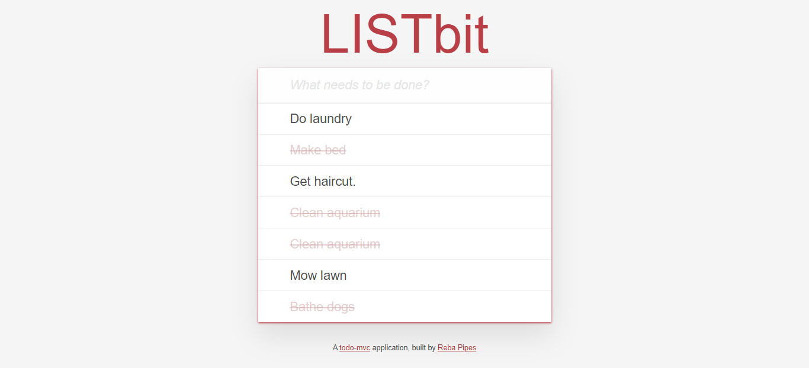
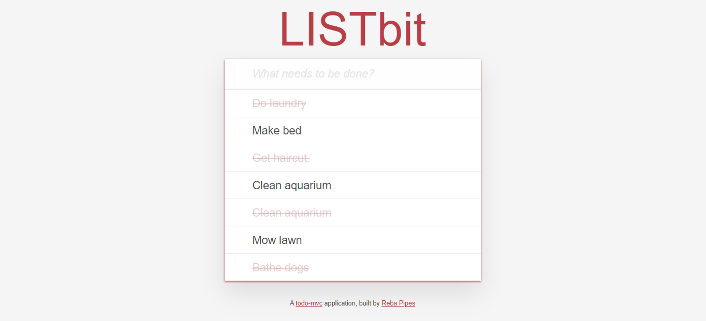
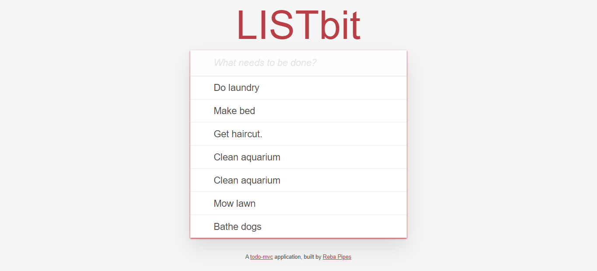
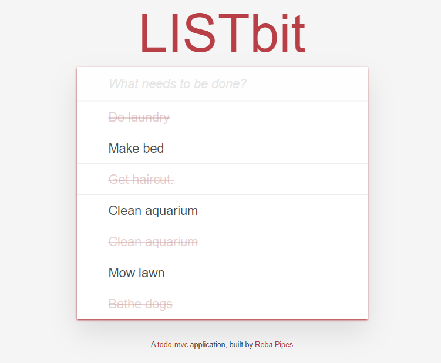

# LISTbit

LISTbit is a single-page to-do application, featuring a fluid user interface that –by using JavaScript– allows users to rapidly add dynamic content.

## Getting Started

Built using Ruby on Rails and JavaScript

## Deployment

Deployed using Heroku (https://www.heroku.com)

## Testing

Please use Heroku link for testing and viewing purposes (see below)

## Built With

* Ruby on Rails
* JavaScript
* MVC Framework

## Meta

Reba Pipes

Email: pipes.reba@gmail.com

LinkedIn: (https://linkedin.com/in/rebapipes)

GitHub: (https://github.com/rebapipes/LISTbit)

Heroku: (https://listbit-reba-pipes.herokuapp.com)

Portfolio: (https://rebapipes.netlify.com)

Medium Blog: (https://medium.com/@rebapipes) 